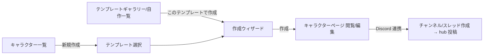

# UI 設計 v1 — テンプレート作成 / キャラクター作成 / Discord 反映の三面設計

> **分類**: 具体設計（[design-v1.md](design-v1.md) の UI 層。3 つの UI の相互契約を主題にする）
> **ステータス**: **確定（v1）** — Claude ドラフトに対し Codex と討論 2 ラウンド（2026-07-07・§6）を実施し、
> 全争点を決着させた版。以後の変更は v1.x として追記する。
> **最終更新**: 2026-07-07

---

## 0. 三面契約（本設計の核）

テンプレートは 1 つの正本から **3 つの UI 面**を生成する。作者は 3 面を同時に設計していることになる。

```
SheetTemplate（正本・schema v3）
  ├─(1) テンプレート作成UI …… 正本そのものを編集する面（エディタ）
  ├─(2) キャラクター作成/編集UI … 正本を「フォーム」として解釈した面（Web）
  └─(3) Discord 反映UI …… 正本を「投影 ViewModel」として解釈した面（Bot）
```

- **契約1: 1 スキーマ・3 レンダラ**。(2)(3) はテンプレートの解釈器であり、独自の追加情報を持たない
  （ユーザー個人による表示上書きは Phase 3+ の拡張）。
- **契約2: 同一評価器**。(1) のプレビュー・(2) のライブ計算・サーバーの materialize は
  すべて `packages/sheet-engine` の同一実装（design-v1 §2）。
- **契約3: Discord 投影の正本は `DiscordProjectionViewModel`**（決着 U1+U10）。
  palette 配列だけでなく、**ボタン行分割・select フォールバック・embed 生成と truncation・警告・
  customId budget** までを純 TS（`packages/sheet-projection`）で算出した ViewModel とし、
  (1) の Discord プレビューとサーバーの component builder は**同一の ViewModel を読むだけ**にする。
  **golden fixture**（同一入力 → ViewModel スナップショット）を Web / サーバー両側のテストが共有し、
  「プレビューと実機のズレ」を CI で検出する。
- **契約4: エディタは (2)(3) の両プレビューを常設**。作者は入力者と卓の見え方を確認せずに publish できない。

## 1. テンプレート作成UI（エディタ）

mock エディタ / ギャラリーの2ルートは #62 裁定で削除済み（2026-08-04）。エディタ / 一覧の正本は
V3 server draft（`templates.tsx` / `templates.$id.edit.tsx`）。Mantine v7・モバイル方針・THEME.md に従う。

### 画面構成

```
┌ ヘッダ: テンプレート名 / version / 保存状態 / [検証] [publish] ┐
├ 左: セクション一覧（追加・並べ替え・削除）                     │
├ 中央: 選択中セクションの編集                                    │
│   ├ フィールド一覧（型バッジ・role バッジ・ドラッグ並べ替え）   │
│   ├ フィールド詳細フォーム（型別プロパティ / 式 / role）         │
│   └ 参照表エディタ（tables: レンジ表のグリッド入力）            │
└ 右（タブ切替）:                                                 │
    [入力プレビュー] … (2) をサンプル値で実演（ライブ計算）        │
    [Discord プレビュー] … ViewModel をそのまま描画（契約3）       │
    [検証結果] … エラー・警告一覧（クリックで該当フィールドへ）    │
```

- 式エディタ: `{` で fieldId 補完（flat 入力 → 保存時 canonical 正規化、design-v1 §2）。
  循環・未定義参照はインライン表示。「試し値」でその場評価。
- role 注釈: フィールド詳細に「Discord に出す」トグル＋group／並び順。結果は Discord プレビューに即時反映。
- Discord プレビューは ViewModel の warnings も表示（soft cap 128 超の select フォールバック、embed 省略発生、
  customId budget 逼迫など）。**ここで見えるもの＝実機**（契約3 が保証）。
- **publish プリフライト**: 全チェック通過が publish の条件 —— 式検証（構文・循環・未定義）／
  visibleTo != public・secret role の拒否（design-v1 §8-11）／palette hard cap 512／
  **embed 制限（25 fields・name/value 文字数・総文字数）と省略規則**（決着 U7）／
  notation の bcdice 検証（サーバー API）／サイズ上限／id 規約。
- エディタ試し値ロール・作成時ロールのプレビューは**卓ロールではない**（チャンネルには一切出ない。決着 U8）。

### draft の保存（決着 U4）

- **サーバー draft が正**。autosave（debounce 数秒）に **draft revision** を付け、他端末更新との競合を検出して
  表示する。publish プリフライトの結果はキャッシュし、変更のあった検査だけ再実行。
- localStorage はクラッシュ復旧キャッシュのみ（mock の `ct.templates.v2` localStorage 正からは卒業）。

## 2. キャラクター作成/編集UI（テンプレート駆動フォーム）

### 入口と遷移



### レンダラの構造（決着 U3）

- `TemplateFormRenderer` は **controlled renderer**（template＋values＋onChange を受けるだけの純粋な描画層）。
  作成ウィザード／編集画面は wrapper が mode・step・ナビゲーション・保存ポリシーを持つ。
  schema v2 の固定 4 タブ・`fieldsInTab` 前提は v3（任意 sections・list/track）で置換する。

### 作成ウィザード

- **セクション単位のステッパー**: テンプレートの sections 順がステップ順。デスクトップは 1 ページ＋
  左ステッパー（自由往来）、モバイルは 1 ステップ 1 画面。構成: `基本情報 → 各セクション → 確認`。
- rollOnCreate フィールドは所属ステップ内に「🎲 振る」＋セクション一括ロール。
- computed はライブ表示・入力不可（式ツールチップ）。クライアント sheet-engine で即時再計算、
  確定は常にサーバー再評価（design-v1 三層モデル）。
- 確認ステップに「Discord ではこう見える」ミニプレビュー（ViewModel の上位グループ）を表示。

### 作成時ロール＝署名付き roll proof（決着 U2）

- `POST /sheet-rolls { notation }` → サーバーが bcdice で実行し **署名付き proof** を返す:
  `HMAC-SHA256(secret, { fieldUid, templateId, templateVersion, userId, notation, result, rolls, createdAt, nonce, exp(30分) })`
- ウィザードは結果＋proof を保持し、create 時に values＋proof 群を提出。サーバーは**全 proof を検証し
  nonce を消費**（Mongo TTL コレクションで replay 防止）。proof は single-use。
- リロールは確定前なら何度でも（都度サーバー実行・最終提出分を採用）。ロール API はレート制限。
- creation draft はサーバーに持たない（ステートレス維持）。

### 編集と保存（決着・欠陥5）

- 編集は同一レンダラの全展開モード。track は ±／ゲージ、list は行追加・削除・複製（rowId 自動発行）、
  relation は相手選択、tag はチップ入力。
- **保存は全 values 提出ではなく `{ baseRevision, dirty フィールドの diff }`**（controlled renderer が dirty 追跡）。
  サーバーは **field 単位＋parts キー単位で auto-merge**: 非重複フィールドは無条件マージ。
  Discord ± は `parts.other` のみ触るため、同一フィールドの base 編集とも共存できる。
  真の重複のみ 409＋conflict payload → **theirs/mine ダイアログ**で解決。

## 3. Discord 反映UI

### hub メッセージ（決着 f・j）

スレッド初期投稿は複数メッセージの縦積みをやめ、**固定の hub 1 メッセージ**に集約する:

```
hub（共有・内容は固定的）
├ embed: キャラ名・テンプレート名・profile role・resource（showInEmbed）の現在値
├ ピン留めボタン: 作者が指定した最重要ロール（最大 4 行 20 個）
└ グループ切替 select（1 行）: 先頭 24 グループ＋「その他…」
```

- **グループ選択への応答は ephemeral パネル**（ユーザー別）: 選択グループのロールボタンを表示。
  20 超はパネル内 select ページング。**共有メッセージをユーザー操作で編集しない**
  （A/B 干渉と edit rate limit を構造的に回避）。
- グループ数 25 超は「その他…」→ ephemeral の group browser（ページング）で吸収。
  **共有 hub の select 自体はページング編集しない**（決着 j: 共有状態非保持と一貫させる）。
- stable `groupId` はテンプレートが保持（既定「セクション＝グループ」＋ role.group 上書き、U6）。
- ロール結果はこれまでどおりチャンネル/スレッドへ公開投稿（履歴保存も既存経路）。

### hub の更新（決着 g）

- **`hubMessageId`（＋チャンネル ID）を character に永続化**し、現行の「直近 50 件からの探索」を廃止。
- 更新は per-character キュー: coalesce/debounce 数秒・in-flight 1・指数 backoff・stale drop
  （常に **latest revision のみ**反映）。
- **edit 失敗は分類して扱う**: `Unknown Message`（削除済み）→ 再投稿して id 更新／
  権限喪失・チャンネル消失 → retry せずエラーマークして通知／一時 rate limit → backoff 再試行。
  分類せず一律 retry すると重複投稿・無限リトライになる（Codex 指摘）。
- resource ± の interaction は 3 秒制約に対し**即時 ack**（deferUpdate または ephemeral 確認）→
  values 書き戻し → hub 反映は非同期キュー。

### 権限（決着 i）

- v1 は 2 値: **ロール系ボタン＝チャンネル/スレッド参加者の全員可**、
  **変異系（resource ± / migrate / hub rebuild）＝キャラ所有者のみ**（discordUserId 一致）。
- GM 例外・秘匿は GM モデル導入時に拡張（design-v1 §8-11 の凍結と整合）。

### Discord 側からの新規作成（決着 U5）

- `/create-character`: テンプレート select（**ピン留め＋最近使用で 25 件以内**、発見系は Web リンク）→
  名前入力 modal → 既定値＋rollOnCreate（サーバーロール）で即作成 → スレッド＋hub 投稿＋
  「Web で仕上げる」リンクボタン。全項目入力は Discord ではやらない（modal 5 入力制約）。

### テンプレート改版との接続（決着 h・欠陥4）

- **palette key の安定性**: key registry は per-character で永続し、同一 fieldRef（uid＋rowId）には
  再 materialize 後も同一 key を再発行 → 旧 hub のボタンは不変フィールドに対して有効なまま。
- **Phase 2 から** キャラページに `templateVersion` バッジ＋「テンプレート更新に自動追従しない」旨を表示
  （版 pin の存在を UI が隠さない）。
- **Phase 3 で** migrate ウィザード最小実装: 差分プレビュー → orphan review（孤児値の破棄確認）→
  palette 再生成（既存 key 維持）→ hub rebuild。orphan 一括レビュー等の充実は Phase 4。

## 4. コード配置（三面の共有点）

| 部品 | 置き場 | 使う面 |
|------|--------|--------|
| 式評価・検証 | `packages/sheet-engine`（design-v1 確定） | (1)(2)(3=サーバー) |
| **DiscordProjectionViewModel 算出**（行分割・fallback・embed truncation・warnings・customId budget） | `packages/sheet-projection`（新設・純 TS） | (1) Discord プレビュー / サーバー materializer・builder |
| **golden fixtures**（入力 → ViewModel スナップショット） | `packages/sheet-projection/fixtures` | 両側の jest が共有参照 |
| `TemplateFormRenderer`（controlled） | `trpg-remix-app/app/features/characterSheet/` | (1) 入力プレビュー / (2) 作成・編集 |
| Discord component builder（ButtonBuilder 等・ViewModel を機械的に組むだけ） | `TRPG-SERVER/src/discord/features/*` | (3) のみ |
| hub 更新キュー・失敗分類 | `TRPG-SERVER/src/discord/features/*`（palette/values 書き戻しは features/character-sheet 経由） | (3) |

## 5. 争点決着表

| # | 争点 | 決着 | 出典 |
|---|------|------|------|
| U1+U10 | Discord 投影の共有範囲 | palette でなく **DiscordProjectionViewModel を正本化**（行分割・fallback・embed truncation・warnings・customId budget）＋golden fixture を両側テストで共有 | R1 条件付き → 受諾 |
| U2 | 作成時ロールの実行場所 | サーバーロール API＋**HMAC 署名付き roll proof**（nonce 消費・TTL・single-use・レート制限）。creation draft は持たない | R1 条件付き → 受諾 |
| U3 | フォームの共用 | TemplateFormRenderer は controlled renderer。wizard/編集は wrapper が mode・step・保存ポリシーを分離 | R1 条件付き → 受諾 |
| U4 | draft の置き場 | サーバー draft 正＋draft revision・競合表示・preflight 結果キャッシュ。localStorage は復旧のみ | R1 賛成 |
| U5 | Discord 側新規作成の範囲 | テンプレ select（ピン留め＋最近使用 ≤25）＋名前 modal ＋Web 誘導まで | R1 条件付き → 受諾 |
| U6+j | グループの正本と上限 | 既定「セクション＝グループ」＋role.group 上書き・stable groupId。hub select は先頭 24＋「その他…」→ ephemeral group browser。**共有 select はページング編集しない** | R1 条件付き → R2(j) 修正受諾 |
| U7 | embed 内容の決定権 | v1 は作者が全決定。embed 25 fields・文字数・省略規則を publish validation と ViewModel warnings に含める | R1 条件付き → 受諾 |
| U8 | Web からの卓ロール | v1 ではやらない。作成時ロール・試し値ロールは卓ロールと別物と明記 | R1 賛成 |
| U9(f) | hub の応答モデル | **hub 固定＋ピン留めボタン（≤20）＋グループ select、応答は ephemeral パネル**（ユーザー別・共有編集なし） | R2(f) Claude 案受諾 |
| U11(h) | migration UI の段階 | Phase 2: templateVersion バッジ＋自動追従しない表示 / Phase 3: migrate ウィザード最小 / Phase 4: 充実 | R2(h) 修正受諾 |
| U12(g) | hub 更新と rate limit | per-character キュー（coalesce・in-flight 1・backoff・latest のみ）＋hubMessageId 永続化＋**edit 失敗の分類**（再投稿可 / 不可 / 一時） | R2(g) 修正受諾 |
| U13(i) | 操作権限 | ロール系＝参加者全員可 / 変異系＝所有者のみ。GM 例外は GM モデル導入時 | R2(i) Claude 案受諾 |
| 欠陥5 | Web 保存と Discord ± の競合 | baseRevision＋dirty diff 提出、field＋parts キー単位 auto-merge、真の重複のみ 409→theirs/mine ダイアログ | R1 欠陥 → 受諾 |

## 6. 討論記録（Codex ×2 ラウンド・2026-07-07）

- **方式**: design-v1 討論と同一プロトコル。Codex にドラフト・design-v1・実コード
  （mock エディタ／characterTemplate AI.ui／thread-interaction.service／characterEdit の embed 更新）を
  読ませ、R1＝構造化レビュー、R2＝収束質問 (f)〜(j)。ファイル変更なし。
- **R1 要旨**: 総評「三面契約の方向性は正しいが確定不可」。
  (1) palette 共有だけでは実機とズレる → ViewModel 正本化＋golden fixture、
  (2) auditId 単体は差し替え・リプレイ可能 → 署名付き proof、
  (3) hub の共有 select 状態管理が未定義（A/B 干渉・edit rate limit）、
  (4) テンプレ改版→palette/hub の破壊経路が薄い → key 安定性ルールと migrate 手順、
  (5) 全 values 提出は Discord ± を上書きする → diff＋merge 設計。追加争点 U9〜U13。→ 全件受諾。
- **R2 判定**: (f) **Claude 案受諾**＝hub 固定＋ephemeral パネル / (g) **修正受諾**＝キュー＋id 永続化に
  「edit 失敗の分類」を追加 / (h) **修正受諾**＝バッジ表示は Phase 2 に前倒し / (i) **Claude 案受諾**＝
  2 値権限 / (j) **修正受諾**＝共有 select は 24＋「その他…」でページング編集しない。
  受諾事項への異論なし・残ブロッカーなし。
- **確定宣言**: 「**可**。(g)(h)(j) の修正を design-v1-ui に反映する条件で確定してよい」→ 本版で反映済み。
- 運用メモ: R2 は転送経路のタイムアウトで Codex ジョブが孤児化する障害があり、companion の
  `--background` ジョブとして再実行して取得した（状態ファイル `state.json` の jobs 配列の手動修復を含む）。
- **持ち越し**: GM/セッション権限モデル（秘匿・GM 例外・リセット発火権限）、ユーザー個別の表示上書き、
  Web からの卓ロール送信（Phase 3 で再検討）、共有シート（P14）。
