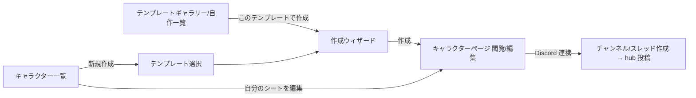

# UI 設計 v1 — テンプレート作成 / キャラクター作成 / Discord 反映の三面設計

> **分類**: 具体設計（[design-v1.md](design-v1.md) の UI 層。3 つの UI の相互契約を主題にする）
> **ステータス**: **確定（v1）** — Claude ドラフトに対し Codex と討論 2 ラウンド（2026-07-07・§6）を実施し、
> 全争点を決着させた版。以後の変更は v1.x として追記する。
> **最終更新**: 2026-08-10（v1.1: U14 レイアウトヒント / v1.2: U15 ブロック・上限・ポイントプール /
> v1.3: 画面×状態の共通契約 SM-1〜SM-17 ＋ §3.6 v1 実装境界表 / v1.4: U16 シートの公開設定 —
> **Codex adversarial 監査 round1〜3 収束済み（round3 pass・証跡 = `review-results/u16-visibility-review/`）**。
> **v1.3 は cross-cut 再レビューと認知負荷/YAGNI 監査を反映した縮約版**
> （**v1 必須／延期／非実装の分類は §3.6 実装境界表が唯一の索引**。step 予算を守る集約コスト上限は
> 実測反例が存在するため v1 必須）。**未決なし**（SM-7 は 2026-08-09 のユーザー裁定で v1 非実装に確定）。

---

## 0. 三面契約（本設計の核）

テンプレートは 1 つの正本から **3 つの UI 面**を生成する。作者は 3 面を同時に設計していることになる。

```
SheetTemplate（正本・schema v3）
  ├─(1) テンプレート作成UI …… 正本そのものを編集する面（エディタ）
  ├─(2) キャラクター作成/編集UI … 正本を「フォーム」として解釈した面（Web）
  └─(3) Discord 反映UI …… 正本を「投影 ViewModel」として解釈した面（Bot）
```

- **契約1: 1 スキーマ・3 レンダラ**。(2)(3) はテンプレートの解釈器であり、独自の追加情報を持たない
  （ユーザー個人による表示上書きは Phase 3+ の拡張）。
- **契約2: 同一評価器**。(1) のプレビュー・(2) のライブ計算・サーバーの materialize は
  すべて `packages/sheet-engine` の同一実装（design-v1 §2）。
- **契約3: Discord 投影の正本は `DiscordProjectionViewModel`**（決着 U1+U10）。
  palette 配列だけでなく、**ボタン行分割・select フォールバック・embed 生成と truncation・警告・
  customId budget** までを純 TS（`packages/sheet-projection`）で算出した ViewModel とし、
  (1) の Discord プレビューとサーバーの component builder は**同一の ViewModel を読むだけ**にする。
  **golden fixture**（同一入力 → ViewModel スナップショット）を Web / サーバー両側のテストが共有し、
  「プレビューと実機のズレ」を CI で検出する。
- **契約4: エディタは (2)(3) の両プレビューを常設**。作者は入力者と卓の見え方を確認せずに publish できない。

## 1. テンプレート作成UI（エディタ）

mock エディタ / ギャラリーの2ルートは #62 裁定で削除済み（2026-08-04）。エディタ / 一覧の正本は
V3 server draft（`templates.tsx` / `templates.$id.edit.tsx`）。Mantine v7・モバイル方針・THEME.md に従う。

### 画面構成

```
┌ ヘッダ: テンプレート名 / version / 保存状態 / [検証] [publish] ┐
├ 左: セクション一覧（追加・並べ替え・削除）                     │
├ 中央: 選択中セクションの編集                                    │
│   ├ フィールド一覧（型バッジ・role バッジ・ドラッグ並べ替え）   │
│   ├ フィールド詳細フォーム（型別プロパティ / 式 / role）         │
│   └ 参照表エディタ（tables: レンジ表のグリッド入力）            │
└ 右（タブ切替）:                                                 │
    [入力プレビュー] … (2) をサンプル値で実演（ライブ計算）        │
    [Discord プレビュー] … ViewModel をそのまま描画（契約3）       │
    [検証結果] … エラー・警告一覧（クリックで該当フィールドへ）    │
```

- 式エディタ: `{` で fieldId 補完（flat 入力 → 保存時 canonical 正規化、design-v1 §2）。
  循環・未定義参照はインライン表示。「試し値」でその場評価。
- role 注釈: フィールド詳細に「Discord に出す」トグル＋group／並び順。結果は Discord プレビューに即時反映。
- Discord プレビューは ViewModel の warnings も表示（soft cap 128 超の select フォールバック、embed 省略発生、
  customId budget 逼迫など）。**ここで見えるもの＝実機**（契約3 が保証）。
- **publish プリフライト**: 全チェック通過が publish の条件 —— 式検証（構文・循環・未定義）／
  visibleTo != public・secret role の拒否（design-v1 §8-11）／palette hard cap 512／
  **embed 制限（25 fields・name/value 文字数・総文字数）と省略規則**（決着 U7）／
  notation の bcdice 検証（サーバー API）／サイズ上限／id 規約。
- エディタ試し値ロール・作成時ロールのプレビューは**卓ロールではない**（チャンネルには一切出ない。決着 U8）。

### draft の保存（決着 U4）

- **サーバー draft が正**。autosave（debounce 数秒）に **draft revision** を付け、他端末更新との競合を検出して
  表示する。publish プリフライトの結果はキャッシュし、変更のあった検査だけ再実行。
- localStorage はクラッシュ復旧キャッシュのみ（mock の `ct.templates.v2` localStorage 正からは卒業）。

## 2. キャラクター作成/編集UI（テンプレート駆動フォーム）

### 入口と遷移



- **自分のページ（キャラクター一覧）から、自分が作成したシートを直接編集できる**（S0 → S4・所有者のみ。
  2026-08-09 ユーザー確認）。一覧の各行に編集導線と公開バッジ（U16）を出す。

### レンダラの構造（決着 U3）

- `TemplateFormRenderer` は **controlled renderer**（template＋values＋onChange を受けるだけの純粋な描画層）。
  作成ウィザード／編集画面は wrapper が mode・step・ナビゲーション・保存ポリシーを持つ。
  schema v2 の固定 4 タブ・`fieldsInTab` 前提は v3（任意 sections・list/track）で置換する。

### 作成ウィザード

- **セクション単位のステッパー**: テンプレートの sections 順がステップ順。デスクトップは 1 ページ＋
  左ステッパー（自由往来）、モバイルは 1 ステップ 1 画面。構成: `基本情報 → 各セクション → 確認`。
- rollOnCreate フィールドは所属ステップ内に「🎲 振る」＋セクション一括ロール。
- computed はライブ表示・入力不可（式ツールチップ）。クライアント sheet-engine で即時再計算、
  確定は常にサーバー再評価（design-v1 三層モデル）。
- 確認ステップに「Discord ではこう見える」ミニプレビュー（ViewModel の上位グループ）を表示。

### 作成時ロール＝署名付き roll proof（決着 U2）

- `POST /sheet-rolls { notation }` → サーバーが bcdice で実行し **署名付き proof** を返す:
  `HMAC-SHA256(secret, { fieldUid, templateId, templateVersion, userId, notation, result, rolls, createdAt, nonce, exp(30分) })`
- ウィザードは結果＋proof を保持し、create 時に values＋proof 群を提出。サーバーは**全 proof を検証し
  nonce を消費**（Mongo TTL コレクションで replay 防止）。proof は single-use。
- リロールは確定前なら何度でも（都度サーバー実行・最終提出分を採用）。ロール API はレート制限。
- creation draft はサーバーに持たない（ステートレス維持）。

### 編集と保存（決着・欠陥5）

- 編集は同一レンダラの全展開モード。track は ±／ゲージ、list は行追加・削除・複製（rowId 自動発行）、
  relation は相手選択、tag はチップ入力。
- track の視覚は style で gauge / checkboxes の 2 種（2026-08-14・TD3）。checkboxes は
  max が評価 ok・整数・1〜30 のときだけ読み取り専用マーク列を描き（チェック数は表示値の
  視覚 cap。raw の超過・負値は数値テキストが明示し続ける）、それ以外（非整数・30 超・0 以下・
  未確定・評価失敗・壊れた保存値）は数値テキストのみへ退避する。詳細契約の正本は
  TemplateFormRenderer.spec の checkboxes pin 群。
- **保存は全 values 提出ではなく `{ baseRevision, dirty フィールドの diff }`**（controlled renderer が dirty 追跡）。
  サーバーは **field 単位＋parts キー単位で auto-merge**: 非重複フィールドは無条件マージ。
  Discord ± は `parts.other` のみ触るため、同一フィールドの base 編集とも共存できる。
  真の重複のみ 409＋conflict payload → **theirs/mine ダイアログ**で解決。

### レイアウトヒント（決着 U14・v1.1 追記 2026-08-09）

面 (1)(2) 専用の描画ヒントをテンプレートに持たせる（「Discord に出す」トグルの対称形。Discord 投影は参照しない）。
キャラクターデータには保存せず、schema v3 への optional 追加のみ（既存テンプレは全てデフォルト解釈・データ移行なし）。

- **語彙**（これ以外は持たない）:
  - `section.layout`: `{ preset: "stack" | "grid" | "table", columns?: 2 | 3 | 4 }`
    （省略時 stack。columns は grid のみ有効）
  - `field.layout`: `{ span?: 1 | 2 | 3 | "full" }`（grid のみ有効。columns 以上の値は full と同義に clamp）
- **型別挙動**: プリセットが並べ替えるのは単純フィールド（scalar / computed / roll）のみ。
  **track / list / relation / tag は常に全幅ブロック**（grid では縮小不可・table では全幅行に降格。
  表の中に表を作らない）。table は 1 フィールド＝1 行で、scalar の parts は列に展開。
  レンダラは未知・不整合なヒントで壊れず、必ず stack 相当へ退化できる。
- **モバイルは固定折り畳みルール**（作者はモバイル用指定を持たない）: grid → 最大 2 列（span≥2 は全幅）／
  table → 自コンテナ内の横スクロール／stack → そのまま。
- **レイアウト起因の publish ブロックはゼロ**: enum 外・範囲外の値も**警告のみで無視**
  （旧記述「enum 外の値だけ Zod で拒否」は決着表と矛盾のため 2026-08-11 修正。H-9 改・9-S1 実装と整合）。
  「grid 以外での span 指定」「table 内の複雑フィールド降格」「span > columns の clamp」は検証タブに警告表示のみ。
- エディタ UI: セクションヘッダにプリセット選択（grid 時のみ列数ステッパー）、フィールド詳細に span 選択
  （grid 時のみ表示・選択肢は 1〜columns−1 ＋ 全幅）。効果は入力プレビューへ即時反映。
- **out-of-scope**: 座標 drag&drop／ブレークポイント別指定／プレイヤー毎のレイアウト編集
  （折り畳み状態のみブラウザローカル保存）／computed を scalar の列として束ねるグルーピング（並び順の隣接で代替）。

### ブロック・上限・ポイントプール（決着 U15・v1.2 追記 2026-08-09）

セクション内のサブグループ（例: 技能セクション内の「戦闘技能」「探索技能」）、能力値由来の上限、
CoC の職業/趣味ポイントのような複数予算の配分を、面 (1)(2) 専用注釈として表現する。
**参照文法 `{section.field}`・ウィザードの「ステップ＝セクション」・Discord 投影はいずれも不変更**。

- **ブロック**: `section.blocks?: [{ id, label, cap?: number | {formula} }]`＋`field.blockId?: string`
  （無指定フィールドは既定ブロックへ）。ブロックは参照パスに現れない純粋な注釈。
  レンダラはブロックを見出し付きグループとして描画し、`cap` をブロック見出しに表示する。
- **上限**: `scalar(number).max?: number | {formula}`（track の `max` と同形・同評価器）。
  適用優先は **field.max ＞ block.cap ＞ なし**。例: 技能 99、母国語 `{能力値.edu}`。
- **parts キー宣言**: 新規プロパティ `scalar.partsKeys?: [{ id, label }]`（v1 の語彙はこれで全部。H-3 改）。
  既存の `parts?: boolean` は**型を変えない**（boolean→union の拡張は破壊的変更になるため
  別プロパティとする。round1 #1）。`partsKeys` の存在＝宣言モード（値形式は従来の
  `{ parts: {...} }` と同一）。`parts: true` との同時指定は publish エラー（二重定義）。
  宣言時はフォームが内訳入力を描画し、U14 table プリセットでは宣言キーがそのまま列に展開される
  （初期値/職業P/趣味P など）。
- **プール**: `section.pools?: [{ id, label, total: number | {formula}, partsKey: string, scope?: blockId[] }]`。
  消費 = scope（省略時はセクション全体）内の number scalar の `parts[partsKey]` 合計。
  残り = total − 消費。ウィザードのステップ見出し／編集画面のセクション見出しに予算バーで表示。
  職業 P/趣味 P は partsKey の異なる 2 プールとして同じ技能群に触れる。
  pool の `total` は通常の式であり、既存の循環検査・publish 検証にそのまま乗る。
- **超過は警告のみ（v1 固定）**: cap/max 超過・プール残りマイナスとも保存・作成をブロックしない
  （ハウスルール・GM 裁量を優先）。ウィザード/編集画面にインライン警告＋エディタ検証タブに警告表示。
  作者選択の enforce フラグは不採用（痛みが出てから再検討）。
- **残りは表示専用**: `{pool.*.remaining}` のような式参照は不可（ref 文法拡張と循環リスクを回避）。
- エディタ UI: セクション編集にブロック管理（追加・並べ替え・cap 式）とプール管理
  （total 式・partsKey 選択・scope 選択）。フィールド詳細に blockId・max・parts キー宣言。
- **out-of-scope**: ブロックの Discord group 既定化（グループ分けは従来どおり role.group 手動）／
  ブロック単位のレイアウト preset 上書き（U14 の preset はセクション単位のまま）／enforce（ハード拒否）モード。

### シートの公開設定（決着 U16・v1.4 追記 2026-08-09）

キャラクターシートに公開フラグを持たせる。**v1 で実装するのはフラグの保存と所有者による切替まで**で、
他人が閲覧する読取経路は v1 に入れない（SM-4）。ただし**公開閲覧は今後必ず入る**（ユーザー裁定）ため、
その時に壊れない形で拘束条件を先に敷く。

- **語彙**: `character.sheet.visibility: 'private' | 'public'`（**既定 `private`**）。
  **境界で扱いを二分する**（U16 round2 #3）—
  **永続データの読込**: 欠落・未知値は **private に正規化**する。責任者は **repository の read 境界**
  （全 read 経路共通の normalizer。lean 読取は Mongoose default 補完を受けないため default 頼みは不可・
  summaries を含む）。**更新 DTO**: `private`/`public` 以外（`unlisted`・未知値）は**正規化せず 422 で拒否**。
  `unlisted` はテンプレート側の語彙（`SheetTemplateVisibility` = private/unlisted/public）に合わせた
  **将来値として予約**。character の visibility は**テンプレートの visibility とは独立**
  （公開シート ≠ 公開テンプレート）。
- **対象媒体は Web のみ**（U16 round1 #1）: この設定が制御するのは**Web の公開範囲だけ**。
  **Discord hub の表示範囲はチャンネル権限に従い、visibility では変わらない**
  （`DiscordProjectionInput` は visibility を受け取らず、active hub は private でも参加者に resource 値を
  表示し続ける — これは §3 の既存契約であり U16 の対象外）。トグルとバッジの説明にこの旨を必ず併記する。
- **§8-11（`visibleTo` の inert 受理禁止）と併存する理由**: あちらは「隠すつもりが隠れない」= fail-open を
  禁じる裁定。U16 は「public にしても v1 では誰も読めない」= **fail-closed** で、漏洩方向の危険がない。
  ただし**UI は誠実に**する: トグルの説明は「公開閲覧の提供は準備中。**Web では現在自分だけが見られます**。
  Discord hub の表示はチャンネル権限に従います。**公開閲覧の開始時には、公開内容の確認をあらためて求めます**」。
- **v1 の実装範囲**: sheet への値保存／キャラページの設定トグル（**変異系＝所有者のみ・U13**）／
  一覧の公開バッジ。**公開読取 API・共有リンク・検索/一覧掲載は作らない**。
- **将来の公開読取のための拘束条件**（v1 の実装がこれを壊さないこと）:
  - **v1 で保存された `public` を将来の公開開始時に自動で有効化しない**（U16 round1 #2）。
    公開読取の有効条件を `visibility === 'public'` 単独にしてはならない。公開閲覧の導入時は、
    所有者に**公開されるページのプレビューを見せた上で再確認**を得たシートだけを公開する
    （旧 `public` は再確認まで公開保留。再確認の機構は導入時に設計）。values は自由記述
    （text/list 等）を含みうるため、「デプロイ日に全値が黙って公開される」経路を封じる。
  - **既存の owner スコープ read を公開化しない**。公開読取は**公開専用 wire（PublicCharacterSheetWire）を
    allow-list で新設**する（U16 round1 #3・除外列挙方式は禁止）: 含めてよいのは**キャラクター名・
    ゲームシステム・表示専用の section/field/表示値のみ**。**`CharacterEntity` を public mapper の
    入力・戻り型に使わない**（`findOne`/`findById` は無所有者スコープの内部 read であり、これを流用して
    「内部項目を omit する」実装は過剰開示になる）。UID/rowId 内部形式・palette 全体
    （fieldRef/notation/deltas/group を含む）・`computedCache`・5 互換投影
    （status/skill/parameter/item/description）・`sheet.revision`・Discord 系
    （discordUserId/channelId/threadId/hub/appliedInteractionIds）・roll proof・timestamps は**構造上含まれない**。
    **非公開と不存在は同一 404**（SM-4 と同じ探索防止）。禁止キーの負テストを必須にする。
  - **private/unlisted テンプレートを使う公開シート**の表示には、テンプレ構造の**表示専用スナップショット**
    （ラベル・並び・型のみ。式・lookup 定義・palette は含めない）が必要になる。この投影は公開読取の
    導入時に設計する（未定義のまま raw values を返す実装は禁止）。
  - 公開の対象は**シート値の閲覧のみ**。ロール実行・変異系は公開対象外（U13 の 2 値権限は不変）。
  - visibility の変更は **`{baseRevision, dirty diff}` の保存経路とは別の専用操作**にする
    （値の競合解決フロー（欠陥5）に設定変更を混ぜない）。
- **out-of-scope（今回のスコープ外・将来対応）**: 非所有者の閲覧 UI（SM-4）／
  **閲覧したシートを自分のシートとしてコピー（フォーク）**。コピーを入れるときの前提を先に記録する
  （U16 round1 #5/#6）—
  - コピーは **allow-list 構築**とする（deny-list 削除ではない）。引き継ぐのは**検証済み `values` と
    版 pin のみ**。materialized シートの pin の実体は `sheet.templateId`/`sheet.templateVersion`
    （`templatePin` は legacy 用で materialized では `templatePin?: never` により禁止）。
  - それ以外はすべて新規生成: characterId・所有者・名前・**`visibility = 'private'` 固定**・
    `sheet.revision = 1`・`hub = none`・channel/thread/appliedInteractionIds 空・timestamps 新規。
    `computedCache`・5 互換投影・palette は pin したテンプレートから**再 materialize** する
    （元の palette key registry・hubMessageId/threadId・roll proof を継承しない）。
  - テンプレート解決は**コピー専用 use case** を新設する。既存 `resolvePublished` は作者限定
    （`assertOwner`）でコピー元作者以外を拒否し、SM-16 の `resolvePinnedRevision` は**既存 pin の
    再解決用**であって新規作成をこれに通すと private/deprecated テンプレの認可迂回になる —
    どちらにも相乗りしない。private/unlisted テンプレのシートをコピー可能にするか
    （作者許可を要求するか・表示スナップショットのみ複製するか）は導入時の設計判断として保留。

#### マトリクス起点の追補（2026-08-09・[u14-u15-verification-matrix.md](u14-u15-verification-matrix.md) H-1〜H-18・Codex round1/round2 反映済み）

- **parts の名前空間**（H-1・round1 #1/#6）: `base` と `other` は**暗黙予約キー**として宣言の有無に
  関わらず常に存在する（Web 編集の base 書込・plain number→base 昇格・Discord ± の other 書込という
  欠陥5 の現行プロトコルを維持）。宣言 keys の id に `base`/`other` は使用不可（Zod 拒否）。
  宣言モードでの書込可能キーは **base・other・宣言キーのみ**で、未知キーへの書込は server 保存時に拒否（422）。
  **Web の diff 契約**（round2 #4）: controlled renderer は宣言キーごとの入力を**必ず個別の
  `{ fieldUid, partsKey }` 変更として生成**する。whole-parts-object の一括書込は禁止
  （キー単位 auto-merge を成立させるため）。フォームの parts 判定は `parts || partsKeys` へ拡張する
  （現行 `sheet-edit.ts` は `field.parts` のみを参照し base 固定 diff = 実装変更点）。
  characterization test は「Web の宣言キー別 diff × Discord other ±」の並行更新がキー単位 merge で
  両立することを end-to-end で固定する。
- **max / cap は parts 合計後の表示値に適用**（H-2）。内訳キー個別の上限は持たない。
- **formula 付き parts key は v1 では持たない**（H-3 改・cogload #4／cross-cut #1）:
  v1 の `partsKeys[]` は **`{ id, label }` のみ**（formula なし＝すべて入力値）。
  `partsKeys[].id` は **field 内一意**・既存 id 規約準拠・予約語 `base`/`other` 不可で、
  重複は publish エラー（H-10 の重複拒否対象）。field の表示値 = Σ(入力 parts)。
  **延期の理由**: formula 1 項目が synthetic node・複合 identity・topological 順・循環検査・
  status 伝播など 11 概念を導入し 8 規範箇所へ波及する一方、失われるのは内訳の自動導出のみ
  （blocks・max/cap・名前付き手入力 parts・職業/趣味 pool・超過警告はすべて成立する）。
  さらに「基本評価（値）と制約評価（status）のどちらが formula parts を所有するか」という
  三面横断の未解決点（cross-cut #1）も同時に消える。
  **v1.1 候補**として台帳に残す。復活の受入条件 = 「導出値を別 computed field でも入力値でも
  表現できず、かつ pool 消費から除外する必要がある実テンプレート」が現れること。
- **when との相互作用は延期**（H-4 撤回・round1 #2）: `when` は現状 publish で一律拒否（凍結中）のため、
  v1 の U15 に when 相互作用は存在しない。when 解禁設計時に「非表示フィールドの消費」を含めて
  end-to-end（publish・evaluator・materializer・フォーム・palette/Discord）で再設計する。
- **負値 parts は許可・警告なし**（H-5。ペナルティ表現。消費は負値込みで合算）。
- **数値系注釈の適用対象はセクション直下の number scalar のみ**（H-6）: max・partsKeys・pool 消費は
  list.itemFields / relation.attrs 内を v1 対象外とする。**blockId 自体は全 field 型に付与可**
  （見出しグルーピングは表示注釈。適用表は H-17）。
- **制約評価 API**（H-7・round1 #3・round2 #1・cross-cut #1）: max / cap / pool total の評価は
  新設の制約評価 API が `{ status: ok | indeterminate | error, value? }` を返す。
  `status='ok'` のときだけ `value: number` を伴う（超過判定・残量・予算バーの算出に使う実数）。
  この **value は表示・比較専用**で、**computedCache / materialize / DiscordProjectionViewModel へは
  写像も永続もしない**（投影・永続に載るのは基本評価の値だけ）。制約結果が基本評価の値を
  上書き・無効化することはない（一方向）。v1 は制約評価から基本評価へ書き戻す経路自体を持たない。
  **判定は 2 段階で決定的**: (1) **評価前の欠落検査が先** — 制約ごとの依存閉包に生入力が存在しない
  **生入力数値フィールド（number scalar・track）**が 1 つでもあれば **indeterminate**（式は評価しない。
  ∴ indeterminate ＞ error の優先。roll / boolean は意図的除外: roll 未入力 → error・boolean 未入力 →
  falsy 分岐 — 既存 evaluator 意味論に従う。旧記述「number scalar」は track 漏れが silent 0 を生む
  実測により 2026-08-11 S5a round3 で拡張）。
  (2) 欠落がない場合のみ評価を実行し、実行時エラー（lookup 不一致・非有限・step 超過）を **error** とする。
  **依存閉包は制約ごとに評価時へ構築**する（入力は publish 済みテンプレート。旧記述「publish 時へ構築」は
  2026-08-11 大粒度 #6 で実装側へ正本訂正 — 実測: 閉包構築込みで約 10〜24µs/回・閉包による template
  刈り込みで直接評価より 24% 速く、publish 時化は閉包 artifact の永続と version 整合の新規不変条件を
  要求し便益 0）: computed ノードを経由して推移的に辿り、
  **lookup の引数式も閉包に含める**（評価全体の平坦な resolvedRefs は使わない）。
  UI は indeterminate を「—」表示・警告抑制、error は警告表示して隠さない。
  既存 computed の「未入力→0」意味論（`evaluator.ts` numberOrZero）は**不変更**。
  共有テストベクタ要件: 直接参照／computed 経由／lookup（該当行あり・なし）の 4 系を fixture 化する。
- **丸めの自動適用はしない**（H-8 改・round1 #4）: max / cap / total の端数は作者が
  既存関数 `floor` / `ceil` / `round` を式に書いて制御する（computed と同一意味論）。
  `settings.rounding` が評価器から未参照である現状の乖離は U15 スコープ外の既知事項とする。
- **schemaVersion は 3 据え置き＋既存 `section.layout` の狭め方**（H-9 改・round1 #1／cross-cut #2）:
  field 側の追加は全て新規 optional プロパティ（partsKeys の別プロパティ化を含む）で既存型を変えない。
  ただし **`section.layout` は既に `unknown`（`types.ts:27`・`publish.ts` の `z.unknown()`）として
  任意値を受理している**ため、U14 型へ単純に狭めると既存の任意 layout 値を publish で拒否しうる。
  規則: **`layout` が `preset` キーを持つときのみ U14 として検証**（値が enum 外・範囲外でも
  **警告のみで無視** — §5 決着表 U14「レイアウト起因の publish ブロックなし」が上位。
  旧記述「enum 外なら publish エラー」は決着表と矛盾していたため 9-S1 実装時に修正・2026-08-11）。
  `preset` を持たない値は**未知の legacy 注釈として無視し stack 扱い＋警告**（データ移行なし）。
  保存時 canonical 化（H-15）は U14 形式にのみ適用する。legacy 値・不正 preset・正当 preset の
  3 系を fixture で固定してから schema を狭める。
- **参照整合の線引き**（H-10 改・round1 #7・round2 #5）: blocks / pools / **partsKeys** の id 重複、
  **不在 blockId・不在 partsKey・scope 不在 block などの作者起因の構造参照不整合はすべて publish エラー**
  （式の未定義参照と同格。壊れた参照を不変な published revision に入れない）。
  **実行時 skew の退化規則表**（主対象 = publish 前の draft プレビュー。published データで万一発生した
  場合も同一規則を防御的に適用し fail しない）:

  | skew | 退化 | 警告 |
  |---|---|---|
  | field.blockId が不在 | 既定ブロック扱いで描画 | あり |
  | pool.scope 内に不在 blockId が混在 | **実在する blockId のみで合算**（全部不在なら消費 0） | あり |
  | pool.partsKey を宣言する field が scope 内に皆無 | 消費 0 | あり |
  | id 重複（blocks / pools / partsKeys） | 最初の定義を採用 | あり |
  | `parts: true` と `partsKeys` の併存 | **parts: true（自由キー）を優先**し宣言キー制限を適用しない | なし（publish は併存を『parts and partsKeys must not be specified together』で拒否〔:581〕— 本行の規則は draft プレビュー限定で発火。大粒度 #9 M4・FIXA レビューで実測訂正） |
- **grid セル内の parts 宣言フィールドは合計値のみ表示**（H-11。内訳はフォーカス時ポップオーバー編集）。
- **予算バー・残り・超過警告・制約評価は sheet-engine 共通ロジック**（H-12 改・round1 #11）:
  利用面は **(1) エディタプレビュー・(2) フォーム・server materialize の三者**（契約2 の対象）。
  テスト要件として `template + raw values → engine/materializer → DiscordProjectionViewModel` の
  **cross-package integration fixture** を追加する（projection 単体 golden だけで三面一致を主張しない）。
- **max / cap / pool total の式は number 必須**（H-13・publish 型検査でエラー）。
- **モバイル table の列多数は横スクロール容認のまま**（H-14。列優先度メカニズムは設けない）。
- **grid の canonical 既定値**（H-15・round1 #8）: 保存時正規化で `columns` 省略 → 2、`span` 省略 → 1 を
  **補完して保存**する（式の flat→canonical と同じ戦略）。normalizer は共有実装とし fixture で
  エディタ/フォーム双方の解釈一致を保証する。
- **table の列規則**（H-16 改・round1 #9／cross-cut #3）: 表の列は**表単位で canonical に決める** —
  対象範囲（ブロック内。ブロックなしならセクション内）の全 number scalar の宣言キーを
  **first-seen union**（先に現れた field の宣言順を基準に、後続 field の未出現キーを末尾へ追加）した
  ものに合計列を加える。**同一 id に異なる label を宣言した場合は publish エラー**（列見出しが
  一意に決まらないため）。その field が持たないキーのセルは**空欄**（評価上は 0 = 既存意味論）。
  `parts: true`（自由キー）のフィールドは**列展開せず**合計＋ポップオーバーに縮退。
- **blockId 適用表と順序規則**（H-17・round1 #10）: 既定ブロック（blockId なし）は blocks より前に表示。
  ブロック順 = blocks 配列順・ブロック内 field 順 = section.fields 順。
  U14 preset は**ブロックごとに再適用**（table はブロックごとに別表・grid はブロックごとに別グリッド）。
- **資源上限は「不変条件＋実測由来の集約上限 1 個」**（H-18 改・round1 #12・round2 #3・cogload #5・
  cross-cut round2 #1・**D-R3 裁定 2026-08-12 で確定**）:
  **不変条件（v1 必須）**: 「**publish を通ったテンプレートは、フィールド本体（computed/roll）の評価が
  テンプレート全体共有の step 予算（既定 10,000）内で必ず完走する**」。1 式あたり AST 256 の既存上限は不変。
  **集約上限は延期しない**（cogload #5 の「反例が実測できたときのみ導入」条件は**既に成立している**）:
  実測反例 = `1+1+1+1+1+1`（11 AST）の computed を 1,024 個持つテンプレートは現行 publish を
  `issueCount=0` で通過し、その後 `evaluateTemplate` が `Evaluation step limit exceeded: 10000` で失敗する。
  → **テンプレート全体の最悪評価コスト上限を publish 検証に 1 個だけ持たせる**（総 AST ノード数などの
  保守的な指標を step 予算から導出する。個別配列の上限 7 個は引き続き延期）。
  `PublishValidationOptions.evaluationStepLimit` を実際の判定へ接続し（現在は宣言のみ）、
  **上記 1,024×11 反例を publish/materialize の回帰テストに固定**する。
  **list 行数上限（D-R3 前半 = 案 (a)）**: list 行は **LIST_ROW_LIMIT（既定 512・仮置き）** を
  上限とし、最悪コスト算出の行反復分は「行上限 × 行内式コスト」で数える。**保存境界は現状
  list 値そのものを不受理**（cap より厳しい fail-closed。値検証 schema に list 分岐を設けない —
  受理を導入する将来スライスで行内容検証〔itemFields 準拠・UNSAFE キー封止〕と保存側 cap を
  セットで設計する。D-R3-IMPL-R2 差し戻し 2026-08-12）。**評価境界は先頭 LIST_ROW_LIMIT 行のみの
  防御退化**（skew データでも fail しない）。
  実装は evaluator 内の**単一定数（公開 options での差し替え不可）** — 見積もり倍率だけを動かす
  公開 listRowLimit オプションは二重レビュー裁定で撤去済み・再導入しない（D-R3-IMPL-R3・
  2026-08-12。表上限との値一致は偶然・定数統合はしない）。仮置き値の変更手順: 上げるときは
  公開済みテンプレートの見積もり再検算が要る・下げるときは既存データの移行裁定が要る。
  **注釈式の予算は独立のまま仕様（D-R3 後半）**: max / cap / pool total など constraint-evaluator
  経由の注釈式は、**式 1 本ごとに独立の step 予算（既定 10,000）** で評価される。テンプレート共有
  予算はフィールド本体にのみ適用され、注釈側の総コストは「式ごとの AST 256 上限 × 独立予算」で
  有界（発散しない）。現実規模テンプレート（6 sections/156 constraints）の注釈一括評価は実測
  median 1.864ms であり、共有予算化・見積もり加算はともに採用しない。この独立性を spec で固定する。
- **グループ選択への応答は ephemeral パネル**（ユーザー別）: 選択グループのロールボタンを表示。
  20 超はパネル内 select ページング。**共有メッセージをユーザー操作で編集しない**
  （A/B 干渉と edit rate limit を構造的に回避）。
- グループ数 25 超は「その他…」→ ephemeral の group browser（ページング）で吸収。
  **共有 hub の select 自体はページング編集しない**（決着 j: 共有状態非保持と一貫させる）。
- stable `groupId` はテンプレートが保持（既定「セクション＝グループ」＋ role.group 上書き、U6）。
- ロール結果はこれまでどおりチャンネル/スレッドへ公開投稿（履歴保存も既存経路）。

### hub の更新（決着 g）

- **`hubMessageId`（＋チャンネル ID）を character に永続化**し、現行の「直近 50 件からの探索」を廃止。
- 更新は per-character キュー: coalesce/debounce 数秒・in-flight 1・指数 backoff・stale drop
  （常に **latest revision のみ**反映）。
- **edit 失敗は分類して扱う**: `Unknown Message`（削除済み）→ 再投稿して id 更新／
  権限喪失・チャンネル消失 → retry せずエラーマークして通知／一時 rate limit → backoff 再試行。
  分類せず一律 retry すると重複投稿・無限リトライになる（Codex 指摘）。
- resource ± の interaction は 3 秒制約に対し**即時 ack**（deferUpdate または ephemeral 確認）→
  values 書き戻し → hub 反映は非同期キュー。

### 権限（決着 i）

- v1 は 2 値: **ロール系ボタン＝チャンネル/スレッド参加者の全員可**、
  **変異系（resource ± / migrate / hub rebuild）＝キャラ所有者のみ**（discordUserId 一致）。
- GM 例外・秘匿は GM モデル導入時に拡張（design-v1 §8-11 の凍結と整合）。

### Discord 側からの新規作成（決着 U5）

- `/create-character`: テンプレート select（**ピン留め＋最近使用で 25 件以内**、発見系は Web リンク）→
  名前入力 modal → 既定値＋rollOnCreate（サーバーロール）で即作成 → スレッド＋hub 投稿＋
  「Web で仕上げる」リンクボタン。全項目入力は Discord ではやらない（modal 5 入力制約）。

### テンプレート改版との接続（決着 h・欠陥4）

- **palette key の安定性**: key registry は per-character で永続し、同一 fieldRef（uid＋rowId）には
  再 materialize 後も同一 key を再発行 → 旧 hub のボタンは不変フィールドに対して有効なまま。
- **Phase 2 から** キャラページに `templateVersion` バッジ＋「テンプレート更新に自動追従しない」旨を表示
  （版 pin の存在を UI が隠さない）。
- **Phase 3 で** migrate ウィザード最小実装: 差分プレビュー → orphan review（孤児値の破棄確認）→
  palette 再生成（既存 key 維持）→ hub rebuild。orphan 一括レビュー等の充実は Phase 4。

## 3.5 画面×状態の共通契約（SM-1〜SM-17・v1.3 追記 2026-08-09）

[screen-state-matrix.md](screen-state-matrix.md)（画面 S0〜S8 × 状態 G1〜G9 の全セル走査）で検出した
未定義状態の裁定。**三面すべてに跨がる共通契約**であり、Web 面（§2）の実装者も必ず読む
（SM-4/8/9/12/14/15/16/17 は Web 側の規則。cogload #1 で §3 配下から独立させた）。
**未決なし**（SM-7 は 2026-08-09 ユーザー裁定で v1 非実装に確定・追加裁定不要）。

- **SM-1 roll proof の原子性**: create 提出の処理順序を固定する —
  (1) **proof 以外のすべての 422 要因を先に完了**（テンプレート解決・入力値検証・materialize 検証）→
  (2) 全 proof の署名・期限・未消費検証 → (3) nonce の条件付き全件消費と character insert。
  **いかなる 422 応答でも nonce は 1 つも消費しない**（proof invalid 時は 422＋失効 fieldUid 一覧。
  ウィザードは該当ステップへ戻して再ロール・他の入力値は保持）。
  **v1 の不変条件はこの 4 点のみ**（cogload #6）: ①処理順序、②いかなる 422 でも無消費、
  ③部分消費禁止、④二重 insert 禁止（characterId を冪等キーとする）。
  実現方式は**実装開始時に配置構成を 1 度判定して単一プロトコルを選ぶ**（transaction が使えるなら
  消費＋insert を同一 transaction、使えないなら消費 → insert とし insert 失敗時は nonce を
  消費済みのまま残す ＝「再利用可能」より「消失」を選ぶ安全側。ユーザーは再ロールで回復）。
  **runtime で 2 方式を併存させない**。「insert 失敗時に再ロールなしで復旧する」が受入条件に
  なった場合のみ transaction を必須化する。
- **SM-2 ウィザード離脱**: creation draft を持たない決着（U2）を維持。dirty 状態での離脱・リロードには
  beforeunload 警告のみ出す。
- **SM-3 空セクション/空ブロック**: エディタは許容（作りかけ）。publish は**警告のみ**（内容系）。
  フォーム/ウィザードでは空セクションのステップ・空ブロックの見出しを**非表示**（スキップ）。
- **SM-4 非所有者のキャラページ**: **v1 は非所有者閲覧なし**（現行どおり read は owner スコープ・
  非所有者は 404 のまま）。**ただし公開閲覧は今後必ず入る**（2026-08-09 ユーザー裁定）ため、
  フラグ（U16）は v1 で用意し、読取経路は**公開専用 read 投影**（public DTO・discordUserId や
  hub/interaction 等の内部メタを除外）として後から新設する。**既存の owner スコープ read を
  公開化する形では実装しない**（過剰開示になるため。U16 の拘束条件）。
- **SM-5 ephemeral パネルの権限表示**: パネル投影の入力に **`canMutate`（viewer=所有者判定）
  capability を追加**し、非所有者には変異系（± 等）を**投影段階で出さない**。表示・ページ遷移のたびに
  再評価する。owner/non-owner 両方の投影 fixture を追加。API 側の権限検査は従来どおり実施（多層防御）。
  **hub の group select は viewer 中立のまま**（U9 の共有メッセージ原則）なので、非所有者が
  resource-only group を選ぶと**表示できる操作が 0 件**になり得る。この場合パネル ViewModel は
  **`no-authorized-actions` 状態**を返し、「この操作はキャラクター所有者のみ実行できます」の
  権限案内を ephemeral 表示する（空パネルにしない。cross-cut #4）。
- **SM-6 hub 状態の導線**: キャラページに hub 状態バッジを表示する。状態名は実装正準の
  **none / publishing / active / error**（`CharacterHubStatus`）。現状態機械は error からの遷移を
  持たない（= L-4）ため、**v1 は状態バッジのみを表示し「hub 再構築」CTA は出さない**
  （disabled ボタンも置かない。未実装機能と L-4 という概念を利用者・実装者に常時見せないため。
  cogload #8）。CTA は error→復旧の遷移と API が実装された時点で、有効な操作として追加する。
- **SM-7 エディタのモバイル（v1 非実装・確定）**: **2026-08-09 ユーザー裁定「後から入れても問題ない」**により
  未決を解消。v1 のエディタは**デスクトップのみ**（フォーム/ウィザードのモバイル対応は U14 どおり実施する）。
  将来対応する際は 1 ペインのタブ切替（セクション／フィールド詳細／プレビュー）を起点にする。
- **SM-8 保存失敗（v1 は 5 要素のみ）**（cogload #7）: ①失敗時は **dirty を保持**（データを失わない）、
  ②「保存されていません」バナーを常掲、③**失敗分類**（ネットワーク断・429・5xx = 再試行可／
  **422 = 恒久エラーで再試行しない**／409・draft revision 競合 = 競合フローへ）、
  ④**single-flight**（送信中の重複送信をしない・常に最新 dirty のみを送る）、⑤**手動再試行**ボタン。
  編集は常に続行可。
  **自動 backoff・`Retry-After` 解釈・jitter・無限自動再試行は延期**（保存失敗の実測頻度と 429 の
  発生を確認してから追加する。延期しても dirty 保持と手動再試行でデータは失われず、失われるのは
  一時障害からの無操作自動回復のみ）。
- **SM-9 実行時評価失敗の退化（二層）**: (a) **基本評価**（`evaluateTemplate` = computed）の throw は
  捕捉し、computed 系を一括「計算エラー」表示に退化・入力値の表示/編集は継続・警告バナー 1 本
  （部分評価は v1 でやらない）。(b) **制約評価**（max / cap / pool total）は H-7 どおり**式ごとに独立**して
  ok / indeterminate / error を判定し、error は該当箇所のインライン警告のみ（他の制約・基本評価に
  波及しない）。基本評価が失敗している間は依存値が得られないため**全制約を indeterminate 扱い**とする。
  **層の所有関係は一方向**（cross-cut #1）: **永続・投影される値は基本評価だけが持つ**。制約評価は
  自分の式の結果（`status='ok'` のときの表示・比較専用 value）と status を返すだけで、
  基本評価の値・computedCache・投影を上書き・無効化することはない。
- **SM-10 一覧系の empty state**: テンプレート一覧・キャラクター一覧とも 0 件は「作成」CTA。
  検索 0 件は条件クリア導線。
- **SM-11 hub の操作なし条件**: 条件は「roll 0 件」ではなく **palette action 0 件（roll も resource もなし）**。
  **ただし「0 件」は viewer 能力に相対的**（cross-cut #4）: hub 共有メッセージの group select は
  viewer 中立（U9）なので palette 基準で判定し、**ephemeral パネル側は canMutate 適用後の
  action 数で判定**して 0 件なら `no-authorized-actions`（権限案内）を返す。
  その場合のみ embed 単体で成立（ボタン・select なし。Web リンクボタンも v1 では出さない =
  HubViewModel の契約を拡張しない）。**resource エントリのみのテンプレでは通常どおり
  group select と ± が生成される**（実投影の挙動が正）。
  **resource の `deltas` は publish で 1 件以上を必須**とする（空配列の構造的発生源を publish で
  閉鎖。**実装済み 2026-08-12 = SM-A・8078b06**。旧記載「0-action group の唯一の発生源」は
  SM-B レビュー実測で反証 — 無効 roll キーのみ・非正準 delta のみの group も button 生成防御で
  0 アクションになる）。projection 側は**実生成可能アクション数 0 の group を select/browser から
  防御的に除外＋警告**（`empty-group-omitted`・退化系発生源を一括被覆。空 deltas 含む。
  H-10 の skew 退化と同格。**実装済み 2026-08-12 = SM-B/R2**）。
- **SM-12 未入力の意味論（層別）**: **基本評価 / materialize** では number→0・boolean→false・
  text/select→''・list→行 0（現行 evaluator の canonical）。**制約評価（H-7）**では依存する生入力の
  欠落 = indeterminate「—」（0 に潰さない）。required の概念は導入しない: 未入力のまま作成可・
  作成をブロックする必須検査はなし（作者は rollOnCreate・既定値で誘導する）。
- **SM-13 新版通知の場所**: キャラページの templateVersion バッジのみ（U11）。
  **hub 共有メッセージには新版通知を出さない**（共有メッセージの内容は固定的、の U9 原則と一貫）。
- **SM-14 データ状態の共通挙動**: **読込中** = スケルトン表示・進行系 CTA（保存・publish・ロール・作成）は
  disabled・既存入力は保持。**取得失敗** = エラー表示＋**手動再試行ボタン**（自動リトライなし）。
  ウィザードは入力保持のまま再試行・エディタは直近 autosave 済み draft を再取得。
  Discord 面は即時 ack（defer）済みのため失敗は ephemeral エラー応答で返す（既存パターン）。
  読込中／空／通常／取得失敗の 4 状態はマトリクスのセルで個別に走査し、1 セルに畳まない。
- **SM-15 theirs/mine の状態機械**: **theirs** = conflict payload の current をローカル base と表示値に
  採用し、該当 path の dirty を解除。**mine** = current を新しい base として自分の値で再送。
  再送がさらに 409 なら**新しい conflict payload で再提示**（常に最新 current 基準・旧 base への
  巻き戻しはしない）。ダイアログ表示中も他 path の編集・保存は継続可。
  **409 の conflict payload に `currentRevision` を追加**し（現行 payload は path/current/base/yours
  のみ = 実装変更点）、theirs / mine とも選択時にローカル baseRevision を currentRevision へ更新する。
  mine の再送は baseRevision=currentRevision で送る（再 fetch の必須化はしない）。
- **SM-16 deprecated テンプレート**: 自作一覧では「削除済み（deprecated）」表示・編集/複製不可。
  ウィザードの入口（テンプレート選択）に出さない。**「既存の版 pin キャラクターは影響を受けない」を
  実効化するため、resolve を v1 で分離する**: `resolveForCreate`（新規作成用・published のみ）と
  `resolvePinnedRevision`（既存 pin キャラの保存・hub 投影・再 materialize 用。published に加え
  **deprecated も許可**・draft 不可・version 一致必須）。現行実装は保存・hub 投影も
  `resolvePublished` を通し deprecated を 409 にするため、このままでは pin キャラの保存・hub 更新が
  壊れる（版 pin 原則違反）— 分離は SM 実装キュー（§6-1 **#11**）で行う
  （旧記載「#10 と同じキュー」は台帳監査 2026-08-11 で #11 へ一本化。実装対象が
  `character-sheet-template.service` の resolve 経路＝#11 の他項目と同層のため）。
  キャラページの templateVersion バッジに「テンプレートは削除済み」注記。
  migrate との統合は Phase 3 M3-3（pinned revision の再生契約と migrate/rebuild を同時確定）。
- **SM-17 legacy キャラクター**: `CharacterState`（legacy-unpinned / legacy-pinned / materialized）を
  状態軸に含める。**テンプレート駆動のシート画面（S4）は materialized のみ対象**。legacy 2 状態は
  キャラクター一覧に「旧形式」バッジを表示し、従来表示＋「移行は Phase 3」案内とする。
  Discord 導線も旧経路のまま。

## 3.6 v1 実装境界表（U14 / U15 / SM の集約・cogload #2）

追記が 3 つに分かれた結果、実装者が規範を探すのに 22 箇所を横断していた。**実装時はまずこの表を見る**
（各行の詳細規範は §2 の追補・§3.5 の SM 追補が正本。委譲プロンプトもこの表を起点に組む）。

| 層 | v1 で実装する | 延期（v1.1 候補） | 非実装（v1 に入れない） |
|---|---|---|---|
| **Schema** | `section.layout {preset, columns}`・`field.layout {span}`・`section.blocks{id,label,cap}`・`field.blockId`・`scalar.max`・`scalar.partsKeys[{id,label}]`・`section.pools{id,label,total,partsKey,scope}`・**`sheet.visibility 'private'\|'public'`（U16）**: `CharacterSheetState`・api-contract `characterSheetStateSchema`（現行 `.strict()` 4 項目のため**追加必須** — 素通しでは parse 拒否）／persistence schema（`character.model`）／materializer は入出力で素通し保持（現行は 4 項目のみ再構築＝実装変更点）／**読込正規化の責任者 = repository の read 境界**（全 read 経路共通・lean 読取は default 補完なしのため Mongoose default に依存しない・round2 #2）／**summary read model**: `CharacterSummaryDto`・`CharacterSummaryWire`・repository の projection select＋mapper に visibility を追加（S0 公開バッジのデータ経路・round2 #1）。読込は欠落・未知値→private、更新 DTO は private/public 以外を 422 拒否（`unlisted` は将来予約） | partsKeys の `formula`（H-3 改） | schemaVersion bump・`parts` の型変更・座標 layout・ブレークポイント別指定 |
| **Publish** | enum 検証（**layout 系の enum・範囲違反は警告のみ・ブロックしない** — §5 U14 決着が上位・H-9 改 2026-08-11。U15 の構造参照系は従来どおりエラー）／`layout` は `preset` キーの有無で U14 判定（legacy は無視＋警告・H-9）／id 重複・不在参照は publish エラー（H-10）／max・cap・total は number 必須（H-13）／`parts:true` と `partsKeys` の同時指定拒否／`base`・`other` 予約（H-1）／数値系注釈はセクション直下 number scalar のみ（H-6）／resource `deltas` min 1（SM-11）／空セクション・空ブロックは警告のみ（SM-3）／**不変条件「publish 通過物は step 予算内で完走」＋実測由来の集約コスト上限 1 個（H-18 改）** | 個別配列の上限 7 個（H-18 改） | `when` 解禁（H-4）・秘匿系・enforce（超過のハード拒否）・schemaVersion bump |
| **Engine** | 制約評価 API `{status, value?}`（**ok のみ value・表示比較専用で永続/投影しない**・H-7）／欠落検査先行（indeterminate ＞ error）／制約ごとの依存閉包（computed・lookup 引数を含む）／max・cap の適用は parts 合計後（H-2）・優先は field.max＞block.cap／pool 消費と残りの算出（負値 parts 込み・H-5）／実行時 skew の退化規則表（H-10）／sheet-engine 共通・server materialize も同一実装（H-12） | synthetic node・status 伝播（formula parts と同時に延期・H-3 改） | 丸めの自動適用（`settings.rounding` は式で明示・H-8）・`{pool.*.remaining}` の式参照 |
| **Save（U16）** | `sheet.visibility` の保存（既定 private・**値の diff 保存とは別の専用操作**・所有者のみ）。専用 enum DTO＋所有者条件付きの単項更新（値の materialize 経路に混ぜない）。公開読取 API・共有リンク・検索掲載は作らない | — | 非所有者 read の公開化（U16 拘束条件）・コピー/フォーク |
| **Save** | 宣言キーごとの個別 `{fieldUid, partsKey}` diff（一括書込禁止・H-1）／parts 判定を `parts \|\| partsKeys` へ拡張／**保存時 canonical 正規化（layout の columns→2・span→1 補完・H-15）**／409 payload に `currentRevision`＋theirs-mine 状態機械（SM-15）／SM-1 の 4 不変条件＋単一プロトコル／SM-8 の 5 要素／**`resolveForCreate` と `resolvePinnedRevision` の分離（SM-16）** | 自動 backoff・Retry-After・jitter（SM-8）／transaction 必須化（SM-1） | required 検査（SM-12）・creation draft のサーバー保持（SM-2） |
| **Renderer（U16）** | キャラページの公開トグル＋「公開閲覧の提供は準備中」の注記／一覧の公開バッジ（**summary read model の visibility を消費**・S0 カードまで） ／**自分のページ（キャラ一覧）からの編集導線** | — | 非所有者向け閲覧画面（SM-4）・コピー/フォーク |
| **Renderer** | 3 preset＋span＋モバイル固定折り畳み／複雑 4 型は常時全幅／grid セル内の parts は合計＋ポップオーバー（H-11）／ブロック見出し・cap 表示・**既定ブロック先頭とブロック毎の preset 再適用（H-17）**／内訳入力・予算バー・超過警告／table の canonical 列（first-seen union・label 一致必須・H-16）＋モバイル横スクロール（H-14）／**エディタの作者 UI（preset/列数/span 選択・ブロック管理・プール管理・blockId/max/partsKeys 編集）**／SM-3・SM-9・SM-10・SM-12・SM-14・SM-17 の表示規則／離脱時 beforeunload 警告（SM-2）／templateVersion バッジと新版通知はキャラページのみ（SM-13）／deprecated 注記（SM-16）／`canMutate` と `no-authorized-actions`（SM-5・SM-11）／hub 状態バッジのみ（SM-6） | — | **エディタのモバイル対応（SM-7・v1 非実装で確定・追加裁定不要）**／hub 再構築 CTA（L-4 裁定前・SM-6）／非所有者のキャラページ閲覧（SM-4）／hub への新版通知（SM-13） |
| **Test** | U14 canonical 正規化 fixture（legacy/不正/正当の 3 系・H-9/H-15）／制約評価の共有ベクタ（直接・computed 経由・lookup 行あり/なし・H-7）／Web 宣言キー diff × Discord other ± の並行更新 characterization（H-1）／owner・non-owner の投影 fixture（SM-5）／`template + raw values → engine/materializer → ViewModel` の cross-package fixture（H-12）／**1,024 式 × 11 AST の publish 拒否回帰（H-18 改）**／**U16**（境界別に二分・round2 #3）: 読込 = 欠落・未知値→private の正規化（`findByIdForOwner` と summaries の双方・raw persisted データ起点）／更新 DTO = `unlisted`・未知値の 422 拒否／owner・non-owner／**既存 read/一覧/Discord 投影が visibility に非連動である負のアサーション**／summary endpoint の公開バッジ回帰（private・public・欠落）／値 diff 保存との並行更新 | 個別上限の境界値ベンチ（実測時） | — |

## 4. コード配置（三面の共有点）

| 部品 | 置き場 | 使う面 |
|------|--------|--------|
| 式評価・検証 | `packages/sheet-engine`（design-v1 確定） | (1)(2)(3=サーバー) |
| **DiscordProjectionViewModel 算出**（行分割・fallback・embed truncation・warnings・customId budget） | `packages/sheet-projection`（新設・純 TS） | (1) Discord プレビュー / サーバー materializer・builder |
| **golden fixtures**（入力 → ViewModel スナップショット） | `packages/sheet-projection/fixtures` | 両側の jest が共有参照 |
| `TemplateFormRenderer`（controlled） | `trpg-next-app/app/features/characterSheet/`（**未実装・新規作成**。旧記載の trpg-remix-app は N6b で撤去済み — 台帳監査 2026-08-11 追随） | (1) 入力プレビュー / (2) 作成・編集 |
| Discord component builder（ButtonBuilder 等・ViewModel を機械的に組むだけ） | `TRPG-SERVER/src/discord/features/*` | (3) のみ |
| hub 更新キュー・失敗分類 | `TRPG-SERVER/src/discord/features/*`（palette/values 書き戻しは features/character-sheet 経由） | (3) |

## 5. 争点決着表

| # | 争点 | 決着 | 出典 |
|---|------|------|------|
| U1+U10 | Discord 投影の共有範囲 | palette でなく **DiscordProjectionViewModel を正本化**（行分割・fallback・embed truncation・warnings・customId budget）＋golden fixture を両側テストで共有 | R1 条件付き → 受諾 |
| U2 | 作成時ロールの実行場所 | サーバーロール API＋**HMAC 署名付き roll proof**（nonce 消費・TTL・single-use・レート制限）。creation draft は持たない | R1 条件付き → 受諾 |
| U3 | フォームの共用 | TemplateFormRenderer は controlled renderer。wizard/編集は wrapper が mode・step・保存ポリシーを分離 | R1 条件付き → 受諾 |
| U4 | draft の置き場 | サーバー draft 正＋draft revision・競合表示・preflight 結果キャッシュ。localStorage は復旧のみ | R1 賛成 |
| U5 | Discord 側新規作成の範囲 | テンプレ select（ピン留め＋最近使用 ≤25）＋名前 modal ＋Web 誘導まで | R1 条件付き → 受諾 |
| U6+j | グループの正本と上限 | 既定「セクション＝グループ」＋role.group 上書き・stable groupId。hub select は先頭 24＋「その他…」→ ephemeral group browser。**共有 select はページング編集しない** | R1 条件付き → R2(j) 修正受諾 |
| U7 | embed 内容の決定権 | v1 は作者が全決定。embed 25 fields・文字数・省略規則を publish validation と ViewModel warnings に含める | R1 条件付き → 受諾 |
| U8 | Web からの卓ロール | v1 ではやらない。作成時ロール・試し値ロールは卓ロールと別物と明記 | R1 賛成 |
| U9(f) | hub の応答モデル | **hub 固定＋ピン留めボタン（≤20）＋グループ select、応答は ephemeral パネル**（ユーザー別・共有編集なし） | R2(f) Claude 案受諾 |
| U11(h) | migration UI の段階 | Phase 2: templateVersion バッジ＋自動追従しない表示 / Phase 3: migrate ウィザード最小 / Phase 4: 充実 | R2(h) 修正受諾 |
| U12(g) | hub 更新と rate limit | per-character キュー（coalesce・in-flight 1・backoff・latest のみ）＋hubMessageId 永続化＋**edit 失敗の分類**（再投稿可 / 不可 / 一時） | R2(g) 修正受諾 |
| U13(i) | 操作権限 | ロール系＝参加者全員可 / 変異系＝所有者のみ。GM 例外は GM モデル導入時 | R2(i) Claude 案受諾 |
| 欠陥5 | Web 保存と Discord ± の競合 | baseRevision＋dirty diff 提出、field＋parts キー単位 auto-merge、真の重複のみ 409→theirs/mine ダイアログ | R1 欠陥 → 受諾 |
| U14 | シートのレイアウト編集 | **プリセット＋span 方式**（stack/grid/table・columns 2〜4・span 1〜full）。面(1)(2)専用ヒントとして schema v3 に optional 追加・Discord 投影は不参照・レイアウト起因の publish ブロックなし・モバイルは固定折り畳み。自由配置 drag&drop とプレイヤー毎編集は不採用（§2 v1.1 追記が仕様正本） | 2026-08-09 ユーザー裁定（チャット設計討議・Codex 討論なし） |
| U15 | セクション内ブロック・上限・ポイントプール | **blocks＋式付き max＋parts キー宣言＋pools 方式**。面(1)(2)専用注釈・参照文法とステップ構造は不変更・超過は警告のみ（v1 固定・enforce 不採用）・プール残りは表示専用・Discord 不参照（block の group 既定化は不採用）（§2 v1.2 追記が仕様正本） | 2026-08-09 ユーザー裁定 → Codex adversarial 監査 round1〜3 収束（pass） |
| U16 | シートの公開/非公開 | **`character.sheet.visibility: private\|public`（既定 private）を v1 で用意**。フラグの保存と所有者トグルのみ実装し、**公開読取経路は v1 に入れない**（fail-closed。§8-11 の inert 禁止は fail-open 方向の裁定なので併存する）。将来の公開読取は**公開専用 read 投影**として新設し既存 owner read を公開化しない。閲覧 UI とシートのコピー（フォーク）は今回スコープ外（§2 v1.4 が仕様正本） | 2026-08-09 ユーザー裁定（「閲覧は v1 に入れないが今後必ず入る」「公開フラグを用意する」「コピーもいずれ可能に」） |
| SM-1〜17 | 画面×状態の未定義（proof 原子性・離脱・空セクション・非所有者・権限表示・hub 状態・保存失敗・評価失敗の二層退化・required/未入力の層別意味論・新版通知・取得失敗・theirs/mine 状態機械・deprecated・legacy キャラ） | **§3.5 画面×状態の共通契約**で 17 件すべてを裁定（**SM-7 は 2026-08-09 ユーザー裁定で v1 非実装に確定・追加裁定不要**）。検証台帳 = screen-state-matrix.md | 2026-08-09 マトリクス走査 → Codex round1〜4 収束 → cross-cut/認知負荷 監査で縮約 |
| 縮約 | 3 追記の積み上げによる過剰実装・分散 | **v1 から延期した項目は §3.6 実装境界表の「延期」列が正本**（H-3・H-18 の個別閾値・SM-1・SM-6・SM-8）。**新設**: §3.6 v1 実装境界表（規範探索 22 箇所 → 1 表） | 2026-08-09 認知負荷/YAGNI 監査（high 1/medium 6/low 1）＋cross-cut 監査（high 3/medium 1）を全件受諾 |

## 6. 討論記録（Codex ×2 ラウンド・2026-07-07）

- **方式**: design-v1 討論と同一プロトコル。Codex にドラフト・design-v1・実コード
  （mock エディタ／characterTemplate AI.ui／thread-interaction.service／characterEdit の embed 更新）を
  読ませ、R1＝構造化レビュー、R2＝収束質問 (f)〜(j)。ファイル変更なし。
- **R1 要旨**: 総評「三面契約の方向性は正しいが確定不可」。
  (1) palette 共有だけでは実機とズレる → ViewModel 正本化＋golden fixture、
  (2) auditId 単体は差し替え・リプレイ可能 → 署名付き proof、
  (3) hub の共有 select 状態管理が未定義（A/B 干渉・edit rate limit）、
  (4) テンプレ改版→palette/hub の破壊経路が薄い → key 安定性ルールと migrate 手順、
  (5) 全 values 提出は Discord ± を上書きする → diff＋merge 設計。追加争点 U9〜U13。→ 全件受諾。
- **R2 判定**: (f) **Claude 案受諾**＝hub 固定＋ephemeral パネル / (g) **修正受諾**＝キュー＋id 永続化に
  「edit 失敗の分類」を追加 / (h) **修正受諾**＝バッジ表示は Phase 2 に前倒し / (i) **Claude 案受諾**＝
  2 値権限 / (j) **修正受諾**＝共有 select は 24＋「その他…」でページング編集しない。
  受諾事項への異論なし・残ブロッカーなし。
- **確定宣言**: 「**可**。(g)(h)(j) の修正を design-v1-ui に反映する条件で確定してよい」→ 本版で反映済み。
- 運用メモ: R2 は転送経路のタイムアウトで Codex ジョブが孤児化する障害があり、companion の
  `--background` ジョブとして再実行して取得した（状態ファイル `state.json` の jobs 配列の手動修復を含む）。
- **持ち越し**: GM/セッション権限モデル（秘匿・GM 例外・リセット発火権限）、ユーザー個別の表示上書き、
  Web からの卓ロール送信（Phase 3 で再検討）、共有シート（P14）。
