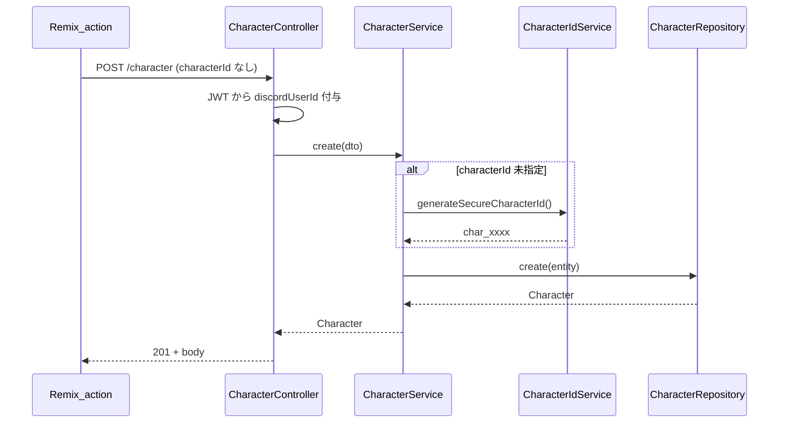
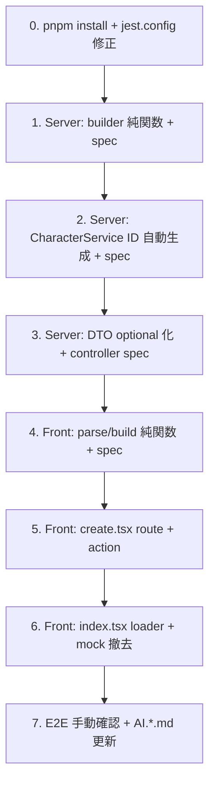

# Phase 0 — キャラクター作成基盤 詳細設計

> ⚠️ **SUPERSEDED（2026-07-12）**: 本書は歴史的文書。再レビュー
> [phase0-character-sheet-review.md](phase0-character-sheet-review.md) により処置が確定した。
> **実施禁止（Replaced）**: §4.1.3 固定5セクション CharacterSheetTemplate 型／§3.2.2 モデル直下
> templateId・templateVersion／§7-3 description への式保存 —— いずれも
> `document/character-sheet-proposals/design-v1.md` v1.2（schema v3・nested sheet/templatePin）が正本。
> **現役**: §2 のコーディング規約（参考）／AttributeValue 意味論（正本は AI.character.md の正準形契約）。
> **ユーザー決定（U-1〜U-3）**: legacy Web 作成は廃止・二重導線は解消・作成導線はテンプレ経由
> （Phase 2 PH-5b）へ再設計。

> **親プラン**: [キャラクター作成ベース設計](../.cursor/plans/キャラクター作成ベース設計_c8529dd9.plan.md)  
> **対象**: Phase 0a（既存修正）+ Phase 0b（型・ドキュメント）  
> **最終更新**: 2026-05-30

---

## 1. 目的

Phase 0 完了時点で以下を満たす。

| # | 成果 |
|---|------|
| 1 | 認証済みユーザーが Remix **action 経由**でキャラクターを作成できる |
| 2 | `characterId` は **サーバーが生成**（フロントは送らない） |
| 3 | キャラクター一覧は **API データ**を表示（モック撤去） |
| 4 | action と UI コンポーネントが **ファイル分離**されている |
| 5 | Character / AttributeValue / Template 方針が **型と AI.\*.md に明文化**されている |
| 6 | 以降の Phase 1〜 で使う **テスト基盤・コーディング規約**が確立されている |

Phase 0 ではテンプレート DB 化（Phase 2）は**行わない**。作成フォームは名前 + ゲームシステムの最小構成でよい。

---

## 2. コーディング規約（Phase 0 以降共通）

### 2.1 TDD（テストファースト）

**原則**: 振る舞いを spec に書いてから実装する（Red → Green → Refactor）。

| レイヤ | テスト種別 | 配置 | 実行 |
|--------|-----------|------|------|
| TRPG-SERVER 純関数 | 単体 | `*.spec.ts`（実装と同階層） | `pnpm test` |
| TRPG-SERVER Service | 単体（モック Repository） | 同上 | 同上 |
| TRPG-SERVER Controller | 単体 / 統合 | 既存パターン踏襲 | 同上 |
| trpg-remix-app 純関数 | 単体 | `app/**/*.spec.ts` | `pnpm test` |
| trpg-remix-app action | 単体（Request モック） | `routes/**/*.spec.ts` または `features/**/actions/*.spec.ts` | 同上 |

**TDD 手順（1機能あたり）**

1. spec に `describe` / `it` で期待振る舞いを列挙（実装前）
2. 最小実装で Green
3. 重複除去・命名整理（Refactor）
4. `pnpm test` / `pnpm run build` で退行なし確認

**Phase 0 で必須のテスト一覧**は [§4.4](#44-phase-0a-テスト一覧tdd-順) / [§5.4](#54-phase-0b-テスト一覧) を参照。

### 2.2 関数型に寄せる

| ルール | 内容 |
|--------|------|
| 純関数優先 | バリデーション・DTO 変換・FormData 解析は **副作用なし**の関数に切り出す |
| 副作用は境界 | DB・HTTP・Cookie 操作は Service / loader / action のみ |
| イミュータブル | DTO・戻り値は `readonly`。スプレッドで更新、直接 mutation 禁止 |
| 合成 | 小さな関数を組み合わせる。10行超の手続きブロックは分割を検討 |
| クラス | NestJS Service / Repository 等フレームワーク要件以外はクラスを増やさない |

**配置例**

```
features/character/
  actions/
    parseCreateCharacterForm.ts   ← 純関数（FormData → CreateCharacterInput）
    buildCreateCharacterPayload.ts ← 純関数（Input + JWT user → API payload）
  actions/createCharacter.action.ts ← 副作用（API 呼び出しのみ）
```

### 2.3 組み合わせ実装のコメント

複数の関数・モジュールを**組み合わせた処理**（action、adapter、orchestrator）には、ファイル先頭または関数直前に **意図コメント**を必須とする。

```typescript
/**
 * キャラクター作成 action のオーケストレーション。
 *
 * 意図:
 * - 認証は Remix action 境界で一度だけ行う（クライアント API 直呼びを禁止）
 * - 入力解析・ペイロード構築は純関数に委譲し、テスト容易性を確保
 * - characterId はサーバーが発行するため、ここでは含めない
 */
```

### 2.4 JSDoc（ソースをドキュメントとして使用）

| 対象 | 必須 JSDoc |
|------|-----------|
| 公開関数（export） | `@param` `@returns` + 1行説明 |
| 純関数 | 前提条件・不変条件があれば `@remarks` |
| 型 / interface | 各プロパティに `/** ... */` |
| action / loader | `@throws` 想定エラー |

**非公開ヘルパー**は自明なら省略可。組み合わせ関数・adapter は省略不可。

```typescript
/**
 * FormData からキャラクター作成入力を解析する。
 * @param formData - Remix action が受け取った FormData
 * @returns 解析結果。必須欠落時は `{ ok: false, errors }`
 */
export function parseCreateCharacterForm(
  formData: FormData
): ParseResult<CreateCharacterInput> { ... }
```

---

## 3. Phase 0a — 既存修正 詳細設計

### 3.1 現状問題マップ

| ID | 問題 | ファイル | 修正方針 |
|----|------|---------|---------|
| P0-1 | `/character/create` 未実装 | `routes/character+/index.tsx` | 新規 `create.tsx` + 一覧からリンク |
| P0-2 | クライアント直接 API | `characterCreate.tsx:66` | Remix `Form` + action |
| P0-3 | action が未使用 | `characterCreate.tsx:10` | route に移動 |
| P0-4 | characterId 空文字 | `characterCreate.tsx:57` | サーバー生成 + フロント削除 |
| P0-5 | モック一覧 | `character+/index.tsx:10` | loader + API |
| P0-6 | action/UI 混在 | `characterCreate.tsx` | 分離 |
| P0-7 | jest roots が `src/` | `jest.config.cjs:2` | `app/` に修正 |
| P0-8 | node_modules 不足で typecheck 失敗 | — | `pnpm install` を Phase 0a 着手前に実施 |

### 3.2 サーバー（TRPG-SERVER）

#### 3.2.1 characterId サーバー生成

**既存資産**: [`CharacterIdService`](TRPG-SERVER/src/domains/character/services/character-id.service.ts)（`generateSecureCharacterId` 等、テスト済み）

**変更箇所**

| ファイル | 変更 |
|---------|------|
| `character.service.ts` | `characterId` 未指定時 `CharacterIdService.generateSecureCharacterId()` を呼ぶ |
| `create-character.dto.ts` | `CharacterInputDto.characterId` を `@IsOptional()` に |
| `character.module.ts` | `CharacterIdService` を `CharacterService` に inject（未登録なら追加） |
| `character.service.spec.ts` | 「ID 未指定で作成成功」ケース追加 |

**純関数化（任意・推奨）**

```typescript
/**
 * 作成 DTO から保存用 Partial<Character> を組み立てる。
 * characterId が undefined の場合は呼び出し側（Service）が付与する。
 */
export function buildCharacterEntity(
  dto: CharacterInputDto,
  characterId?: string
): Partial<Character>
```

`buildCharacterEntity` を `character.builder.ts` 等に切り出し、spec を先に書く。

**シーケンス**



#### 3.2.2 Character モデル拡張（Phase 0b と兼用可能だが型定義のみ先行可）

Phase 0b で本格化。Phase 0a では **optional フィールド追加のみ**（既存データ互換）:

```typescript
@Prop()
templateId?: string

@Prop()
templateVersion?: string
```

マイグレーション不要（MongoDB スキーマレス）。

### 3.3 フロント（trpg-remix-app）

#### 3.3.1 ファイル構成（Phase 0a 完成形）

```
app/
├── routes/
│   └── character+/
│       ├── index.tsx          # 一覧（loader のみ、モック撤去）
│       └── create.tsx         # 作成（loader + action）★新規
└── features/
    └── character/
        ├── actions/
        │   ├── parseCreateCharacterForm.ts      ★純関数
        │   ├── parseCreateCharacterForm.spec.ts ★TDD
        │   ├── buildCreateCharacterPayload.ts   ★純関数
        │   ├── buildCreateCharacterPayload.spec.ts
        │   └── createCharacter.server.ts        ★副作用（API 呼び出し）
        ├── components/
        │   └── CharacterCreateForm.tsx          ★UI のみ（旧 characterCreate から改名）
        └── index.ts                             # action export 削除
```

**削除・非推奨**

- `characterCreate.tsx` 内の `export async function action` → 削除
- `characterCreate.tsx` 内の `createCharacter()` 直接呼び出し → 削除

#### 3.3.2 ルート: `character+/create.tsx`

```typescript
/**
 * キャラクター作成ページ。
 * - loader: ゲームシステム選択肢（既存 gameSystemOptions）+ 認証チェック
 * - action: parse → build → API → redirect or validation errors
 */
```

| 項目 | 仕様 |
|------|------|
| HTTP GET | 未認証 → `/login` へ redirect |
| HTTP POST | `_action=create` + `characterName` + `gameSystemId` |
| 成功 | `redirect('/character')` または `/user/character`（既存導線に合わせる） |
| 失敗 | `json({ errors }, { status: 400 })` + Form に `useActionData` 表示 |

**認証パターン**: [`_user.user.character.tsx`](trpg-remix-app/app/routes/_user.user.character.tsx) と同様

- `getJwtFromRequest(request)`
- `setServerRequestContext(request, jwt)`
- `validateJwt`（必要なら）

#### 3.3.3 ルート: `character+/index.tsx` 修正

| 変更 | 内容 |
|------|------|
| 撤去 | `mockCharacters` 定数 |
| 追加 | `loader` で `getUserCharacterSummaries()` or `getUserCharacters()` |
| 追加 | 「新規作成」→ `<Link to="/character/create">` |
| 撤去 | 埋め込み `<CharacterCreate />`（作成は create ページへ） |

**参考実装**: `_user.user.character.tsx` の loader パターンを共通化検討（Phase 0a ではコピー可、DRY は Phase 1）。

#### 3.3.4 純関数: `parseCreateCharacterForm`

```typescript
/** 作成フォームの入力型 */
export interface CreateCharacterInput {
  readonly characterName: string
  readonly gameSystemId: string
}

/** 解析結果（Result 型でエラーを明示） */
export type ParseResult<T> =
  | { readonly ok: true; readonly value: T }
  | { readonly ok: false; readonly errors: ReadonlyArray<FormFieldError> }

/**
 * FormData から CreateCharacterInput を解析する。
 * characterId / discordUserId は意図的に含めない（サーバー責務）。
 */
export function parseCreateCharacterForm(formData: FormData): ParseResult<CreateCharacterInput>
```

**バリデーション規則**

| フィールド | 規則 |
|-----------|------|
| characterName | 必須、trim 後 1〜100 文字 |
| gameSystemId | 必須、`gameSystemOptions` に存在 |

#### 3.3.5 純関数: `buildCreateCharacterPayload`

```typescript
/**
 * API 送信用ペイロードを組み立てる。
 * @remarks discordUserId は API 側（Controller）が JWT から付与するため含めない
 */
export function buildCreateCharacterPayload(
  input: CreateCharacterInput
): PartialInputCharacterDto
```

返却例:

```json
{
  "characterName": "探偵太郎",
  "gameSystemId": "coc",
  "status": {}
}
```

#### 3.3.6 コンポーネント: `CharacterCreateForm.tsx`

- `@remix-run/react` の `<Form method="post">` を使用
- props: `gameSystemOptions`, `errors?`, `defaultValues?`
- **API・auth import 禁止**（Presentational）

### 3.4 Phase 0a テスト一覧（TDD 順）

#### TRPG-SERVER（先に着手）

| 順 | ファイル | テストケース |
|----|---------|-------------|
| 1 | `character.builder.spec.ts`（新規） | DTO → Entity 変換、characterId optional |
| 2 | `character.service.spec.ts` | ID 未指定時 IdService が呼ばれ create 成功 |
| 3 | `character.service.spec.ts` | ID 未指定 + IdService モックが ID を返す |
| 4 | `character.controller.spec.ts` | POST body に characterId なしで 201 |

#### trpg-remix-app

| 順 | ファイル | テストケース |
|----|---------|-------------|
| 1 | `parseCreateCharacterForm.spec.ts` | 正常入力 |
| 2 | 同上 | characterName 空 → errors |
| 3 | 同上 | 未知 gameSystemId → errors |
| 4 | `buildCreateCharacterPayload.spec.ts` | characterId が含まれないこと |
| 5 | `create.action.spec.ts`（任意） | 未認証 → 401/redirect |

#### テスト基盤修正

| ファイル | 修正 |
|---------|------|
| `jest.config.cjs` | `roots: ['<rootDir>/app']`, `moduleNameMapper: { '^~/(.*)$': '<rootDir>/app/$1' }` |

### 3.5 Phase 0a 受け入れ条件（DoD）

- [ ] `pnpm install` 後 `pnpm typecheck` が trpg-remix-app で成功
- [ ] `pnpm test` が TRPG-SERVER / trpg-remix-app 双方で Phase 0a 追加分 Green
- [ ] `/character/create` で Form 投稿 → DB に character 保存
- [ ] 保存された character に `characterId` が非空
- [ ] `/character` 一覧に作成直後のキャラが表示
- [ ] 未認証で create にアクセス → login へ
- [ ] `characterCreate.tsx` に `@remix-run/node` import がない

### 3.6 Phase 0a 実装順序



---

## 4. Phase 0b — 型・ドキュメント 詳細設計

### 4.1 型整合（フロント ↔ サーバー）

#### 4.1.1 AttributeValue 統一

サーバー [`attribute.types.ts`](TRPG-SERVER/src/core/types/attribute.types.ts) を正とする。

| フィールド | 型 | 用途 |
|-----------|-----|------|
| name | string? | 表示名 |
| index | number? | 並び順 |
| values | Record<string, number>? | 合算対象数値 |
| description | string? | 説明 / **テンプレート時は計算式** |
| dice | string? | **テンプレート時はダイス式** |
| isVisible | boolean? | UI 出し分け |

**フロント修正**

| ファイル | 変更 |
|---------|------|
| `app/types/character.ts` | `CharacterAttribute` を `AttributeValue` に置換 or エイリアス |
| `app/features/character/AI.character.md` | 上記マッピングを記載（現空ファイル） |

#### 4.1.2 CreateCharacterDto / PartialInputCharacterDto

| フィールド | Phase 0b 変更 |
|-----------|--------------|
| characterId | optional（サーバー生成） |
| templateId | optional 追加 |
| templateVersion | optional 追加 |
| discordUserId | フロントから送らない（ドキュメント明記） |

#### 4.1.3 CharacterSheetTemplate 型（ドキュメント + 型のみ）

Phase 2 実装前の**型定義ファイル**を追加（DB 未接続）:

```
app/types/character-sheet-template.ts   # フロント共有型
TRPG-SERVER/src/core/types/character-sheet-template.types.ts  # サーバー（Phase 2 で model 化）
```

```typescript
/**
 * キャラクターシートテンプレート（Character 同型セクション + メタ）
 */
export interface CharacterSheetTemplate {
  readonly templateId: string
  readonly templateName: string
  readonly gameSystemId: string
  readonly authorDiscordUserId: string
  readonly visibility: 'private' | 'public' | 'unlisted'
  readonly version: string
  readonly status: AttributeSection
  readonly skill: AttributeSection
  readonly parameter: AttributeSection
  readonly item: AttributeSection
  readonly description: AttributeSection
  readonly tags?: ReadonlyArray<string>
  readonly createdAt?: string
  readonly updatedAt?: string
}
```

### 4.2 ドキュメント更新一覧

| ファイル | 更新内容 |
|---------|---------|
| [`TRPG-SERVER/AI.character.md`](TRPG-SERVER/AI.character.md) | templateId/templateVersion、AttributeValue 拡張利用、ID 生成方針 |
| [`TRPG-SERVER/AI.md`](TRPG-SERVER/AI.md) | Phase 0 完了メモ |
| [`trpg-remix-app/app/features/character/AI.character.md`](trpg-remix-app/app/features/character/AI.character.md) | Template / Character / Remix action 責務分界 |
| [`trpg-remix-app/AI.test.md`](trpg-remix-app/AI.test.md) | jest 設定、TDD 規約、配置ルール（現1行 → 拡充） |
| [`document/phase0-character-sheet.md`](document/phase0-character-sheet.md) | 本ファイル（実装後に DoD チェック更新） |

### 4.3 characterTemplate との関係（Phase 0b で明文化）

| 概念 | Phase 0 | Phase 1+ |
|------|---------|----------|
| characterTemplate DSL (`fields[]`) | 変更なし | adapter で AttributeSection と双方向変換 |
| Preview / Editor | mock ルート維持 | FormGridRenderer 抽出は Phase 1 |
| mappingStore | ドキュメントのみ | Phase 4 で preset マッピング |

**adapter 関数（Phase 1 用インターフェース定義のみ Phase 0b）**

```typescript
/**
 * Character の AttributeSection を UI フィールド一覧に変換する。
 * @remarks 計算式は AttributeValue.description、ダイスは .dice から読む
 */
export function attributeSectionToFields(
  section: AttributeSection,
  tab: TabType
): ReadonlyArray<Field>

/**
 * UI 入力値を Character の AttributeSection に書き戻す。
 */
export function fieldsToAttributeSection(
  fields: ReadonlyArray<Field>,
  values: EvaluationContext
): AttributeSection
```

spec ファイル名だけ Phase 0b で作成し、中身は `it.todo` でも可（Phase 1 TDD 開始点）。

### 4.4 Phase 0b テスト一覧

| 順 | ファイル | テストケース |
|----|---------|-------------|
| 1 | `app/types/character.spec.ts`（任意） | 型の compile-only（tsc で足りる） |
| 2 | `attributeSectionToFields.spec.ts` | 空セクション → 空配列（Phase 1 本実装） |
| 3 | `character.builder.spec.ts` | templateId optional が Entity に含まれる |

### 4.5 Phase 0b 受け入れ条件（DoD）

- [ ] フロント `Character` 型がサーバー `AttributeValue` と矛盾しない
- [ ] `AI.character.md`（サーバー・フロント）に Template/Character 関係が記載
- [ ] `AI.test.md`（フロント）に TDD / jest 設定が記載
- [ ] `CharacterSheetTemplate` 型がフロントに存在（未使用でも可）
- [ ] Character モデルに templateId / templateVersion が optional で存在

### 4.6 Phase 0b 実装順序

1. サーバー Character モデル + DTO に optional フィールド追加
2. フロント `app/types/character.ts` 整合
3. `CharacterSheetTemplate` 型ファイル追加
4. AI.\*.md 更新
5. adapter インターフェース + todo spec 追加

---

## 5. リスクと対策

| リスク | 対策 |
|--------|------|
| Discord 経由作成が characterId 必須前提 | Event Handler 経路は従来通り ID 付き DTO を送る。Web 経路のみ optional |
| jest roots 不一致でテスト未実行 | Phase 0a 最初に jest.config 修正 |
| `_user.user.character` と `/character` の二重導線 | Phase 0a では両方動く状態を維持。リンク先を `/character/create` に統一 |
| description の二重用（式 vs 説明文） | Phase 0b ドキュメントに「テンプレート時のみ式」規約。Phase 1 以前に prefix 規約を決める |

---

## 6. Phase 1 以降への引き継ぎ

Phase 0 完了後、以下が Phase 1 の入力になる。

- 動作する `/character/create` + Remix action パターン（テンプレート選択 UI を載せる土台）
- テスト済み pure function 群（parse / build / builder）
- 統一 AttributeValue 型
- CharacterSheetTemplate 型（DB 実装は Phase 2）

---

## 7. 未決事項（Phase 0 中に決める）

| # | 論点 | 推奨（Phase 0a 判断可） |
|---|------|------------------------|
| 1 | 作成成功後 redirect 先 | `/user/character`（認証済み一覧が既に API 連携済み） |
| 2 | `/character` vs `/user/character` どちらを正とする | Phase 0a は両方 loader 化。中長期は `/user/character` を正 |
| 3 | description の式 prefix | `formula:` prefix（Phase 0b ドキュメントに仮記載） |
